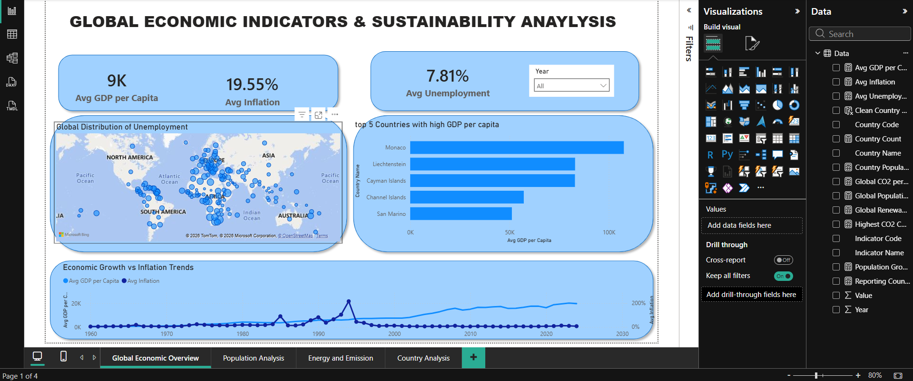

# 🌍 Global Development Power BI Dashboard

An interactive **Power BI dashboard** analyzing global economic, population, and sustainability indicators using the **World Bank World Development Indicators (WDI)** dataset.

This project explores how **economic growth, population changes, and energy transition trends** vary across countries and over time.

---

# 📊 Dashboard Overview

The dashboard contains **four analytical pages** designed to explore global development from multiple perspectives.

---

## 1️⃣ Global Economic Overview

This page analyzes key global economic indicators.

**Key metrics**
- Average GDP per capita
- Global inflation
- Global unemployment rate

**Insights**
- GDP per capita shows a **consistent upward trend since the 1960s**.
- Inflation experienced spikes in earlier decades but **stabilizes in recent years**.
- Smaller financial hubs such as **Monaco and Liechtenstein rank among the highest GDP per capita globally**.

---

## 2️⃣ Global Population Insights

This page focuses on global demographic trends.

**Key metrics**
- Total global population
- Population growth rate
- Population distribution by country

**Insights**
- Global population has grown from **~3 billion in 1960 to over 8 billion today**.
- **India and China dominate global population share**.
- Population growth rate is **gradually slowing**, indicating demographic transition.

---

## 3️⃣ Energy & Carbon Insights

This page explores sustainability indicators.

**Key metrics**
- Global CO₂ emissions per capita
- Renewable energy share
- Highest emitting countries

**Insights**
- Countries with **lower renewable energy adoption tend to have higher CO₂ emissions per capita**.
- Developed countries such as the **United States, Canada, and Australia show higher emissions per person**.
- Global renewable adoption trends indicate a **slow but steady shift toward cleaner energy sources**.

---

## 4️⃣ Country Development Profile

Interactive page for analyzing **individual country trends**.

Users can select a country and explore:

- GDP per capita trends
- CO₂ emissions trends
- Renewable energy usage
- Economic indicators by year

Example shown below for **India**.

---

# 🛠 Tools & Technologies

- **Power BI**
- **DAX**
- **Power Query**
- **Data Visualization**
- **World Bank Open Data**

---

# 📂 Dataset

World Bank World Development Indicators  
https://data.worldbank.org/

---

# 🚀 Project Goal

The objective of this project was to build a **multi-page analytical dashboard** that:

- Visualizes global development trends
- Compares countries across economic and environmental indicators
- Demonstrates interactive dashboard design using Power BI

---

# 👤 Author

Sandeep Patnaik
